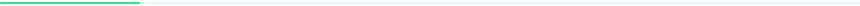

# Hi, my name is Jack 👋 and I ❤️ AI and Memes

`🧠 AI` `💸 Finance` `🐈 Cat Enthusiast` `😹 Meme & Reels enjoyer`

**Field of interests:** Generative AI · AI Agents · Geospatial ML · Computer Vision · Financial AI

 

<samp>
  <a href="#-achievements">achievements</a> &nbsp;·&nbsp;
  <a href="#-publications">publications</a> &nbsp;·&nbsp;
  <a href="#-toolbox">toolbox</a> &nbsp;·&nbsp;
  <a href="#-stats--data">stats</a>
</samp>

  

## 🏆 Achievements

<table>
  <tr>
    <td nowrap>🥇 <b>AIHack Thailand 2021</b> Winner</td>
    <td>Highest AUC in the <i>AI × Financial Data</i> track — built an ensemble classifier that predicts Long-Overdue Debtors from raw debtor data.</td>
  </tr>
  <tr>
    <td nowrap>🌊 <b>ARV Hackathon 2021</b> Winner</td>
    <td>Best mAP@0.5 among 20 finalist teams — generated a synthetic underwater dataset and trained YOLOv5 to detect subsea objects. → <a href="https://github.com/JackDeBuff/ARVhackathon"><code>ARVhackathon</code></a></td>
  </tr>
  <tr>
    <td nowrap>⚗️ <b>TMLCC 2021</b> 1st Runner-up</td>
    <td>Thailand ML for Chemistry Competition — predicted gas adsorption of metal-organic frameworks with multimodal Graph Neural Networks. → <a href="https://github.com/JackDeBuff/TMLCC"><code>TMLCC</code></a></td>
  </tr>
  <tr>
    <td nowrap>🧠 <b>Intel ISEF 2018</b> Finalist</td>
    <td>Represented Thailand with an EEG-based biometric authentication system — the same project later won <b>Best of IT, Prime Minister's Science Awards 2019</b> and <b>1st Prize, ASEAN Student Science Project 2018</b>.</td>
  </tr>
  <tr>
    <td nowrap>🎖️ <b>National Youth Award 2019</b> Winner</td>
    <td>Outstanding national award in Innovation &amp; Invention from Thailand's Ministry of Social Development and Human Security.</td>
  </tr>
</table>

## 📄 Publications

- 🧠 **[EEG-Based Person Authentication Using Deep Learning with Visual Stimulation](https://doi.org/10.1109/KST.2019.8687819)** — *IEEE KST 2019*
   SSVEP + ERP brainwaves → LSTM → your brain is your password. **35 citations 📈 and climbing**
- 🛰️ **[Thailand Asset Value Estimation Using Aerial or Satellite Imagery](https://doi.org/10.1109/TENCON58879.2023.10322494)** — *IEEE TENCON 2023*
   A breakthrough that pioneered AI-driven asset valuation in the Thai asset industry 🚀 — appraisals that took **two weeks now take minutes**.

## 🧰 Toolbox

## 📊 Stats & Data

  

<picture>
  <source media="(prefers-color-scheme: dark)" srcset="https://raw.githubusercontent.com/JackDeBuff/JackDeBuff/output/github-contribution-grid-snake-dark.svg"/>
  <source media="(prefers-color-scheme: light)" srcset="https://raw.githubusercontent.com/JackDeBuff/JackDeBuff/output/github-contribution-grid-snake.svg"/>
  
</picture>

 

  

### Du bist gut genug~ 🎶🕺

